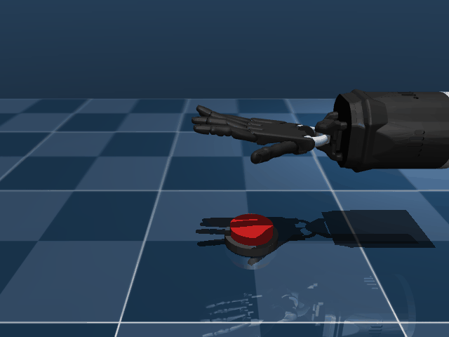
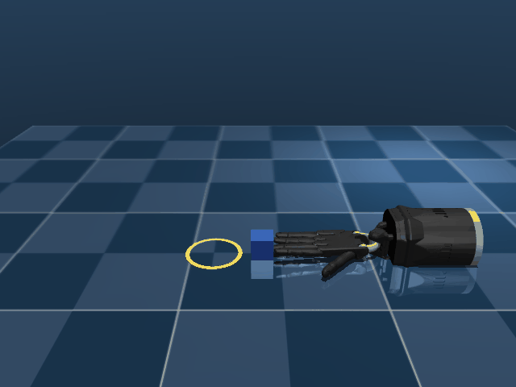
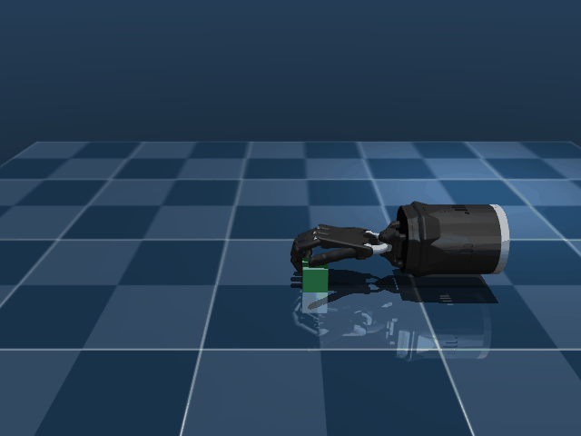
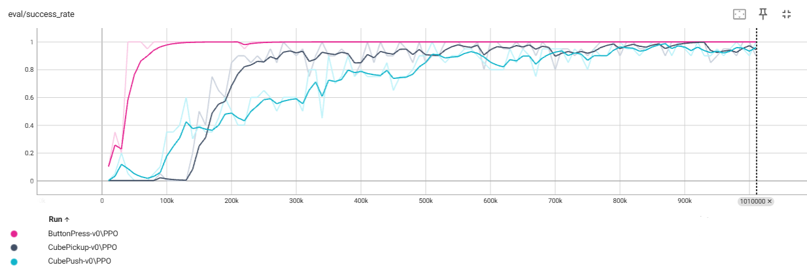
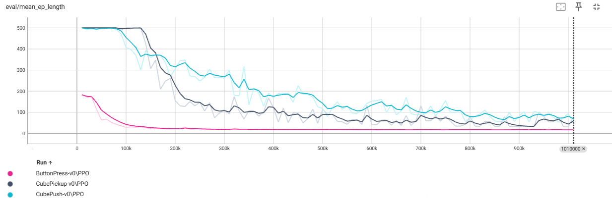

# DexterGym

Shadow Hand dexterous manipulation environments for reinforcement learning, built with MuJoCo and Gymnasium.

## Tasks

| Task | Demo | Success Criteria |
|------|------|-----------------|
| `ButtonPress-v0` |  | Button pressed >4mm |
| `CubePush-v0` |  | Cube inside ring |
| `CubePickup-v0` |  | Cube lifted to 10cm with 2+ fingers |

## Installation

```bash
pip install -r requirements.txt
```

## Usage

### Train with PPO
```bash
python train.py --task ButtonPress-v0 --timesteps 1000000
python train.py --task CubePush-v0 --timesteps 1000000
python train.py --task CubePickup-v0 --timesteps 1000000
```

### Evaluate trained model
```bash
python evaluate.py --task ButtonPress-v0
python evaluate.py --task CubePickup-v0 --render  # with visualization
```

### View TensorBoard logs
```bash
tensorboard --logdir tb_logs/
```

## Code Structure

```
dextergym/
├── assets/
│   ├── mujoco_menagerie/           # Shadow Hand meshes
│   └── scenes/
│       ├── shadow.xml              # Shadow Hand model (shared)
│       ├── button_press.xml        # Button task scene
│       ├── cube_push.xml           # Push task scene
│       └── cube_pickup.xml         # Pickup task scene
├── envs/
│   ├── __init__.py                 # Task registration
│   ├── base_env.py                 # Base environment (delta actions, rendering)
│   ├── button_press_env.py         # ButtonPress task
│   ├── cube_push_env.py            # CubePush task
│   └── cube_pickup_env.py          # CubePickup task
├── train.py                        # PPO training with success-rate evaluation
├── evaluate.py                     # Model evaluation
├── models/                         # Saved models and VecNormalize stats
├── tb_logs/                        # TensorBoard logs
└── logs/                           # Evaluation results (.npz)
```

## Architecture

### Shadow Hand
- **26 degrees of freedom**: 6 DoF floating base (x, y, z, roll, pitch, yaw) + 20 finger joints
- Mesh visuals with primitive collision geometry

### Delta Actions
All tasks use **delta actions** — the agent outputs a nudge (±3% of joint range per step) applied to the current joint position, rather than a target position. This allows smooth, incremental control.

### Training
- **Algorithm**: PPO (Proximal Policy Optimization) via Stable-Baselines3
- **Normalization**: VecNormalize for observation and reward normalization
- **Evaluation**: Custom callback saves the best model by success rate
- **Parallel envs**: 8 SubprocVecEnv workers

## Results

| Success Rate | Mean Episode Length |
|:---:|:---:|
|  |  |

All three tasks reach 90%+ success rate within 1M timesteps of PPO training.

## Notes

- All task objects use **primitive collision shapes** (box, sphere, cylinder, capsule) with stiff contact parameters to prevent penetration
- Contact stiffness: `solref="0.001 1" solimp="0.99 0.99 0.001"`
- Early termination on success with remaining-step bonus rewards

## Acknowledgments

The Shadow Hand model is from [MuJoCo Menagerie](https://github.com/google-deepmind/mujoco_menagerie) by Shadow Robot Company Ltd, licensed under [Apache 2.0](assets/mujoco_menagerie/shadow_hand/LICENSE).